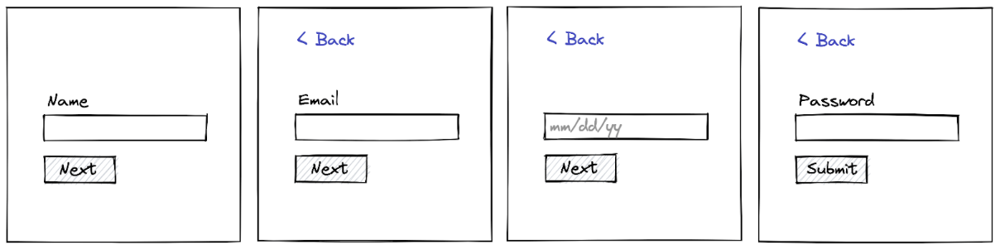

# Step Sign Up Form

## Question

Your PM has asked you to create the most annoying signup form in the world: a form that has 4 fields but on a series of 4 different screens. Your name, email, date of birth, and password will be entered separately into the site

## Requirements

Back links appear on every screen other than the first one, going back to the step the user was just on
Input is required on every screen prior to proceeding to the next.
On the last screen, provide a submit button
After submitting, show a success screen and display the details of the user

## Wireframes

